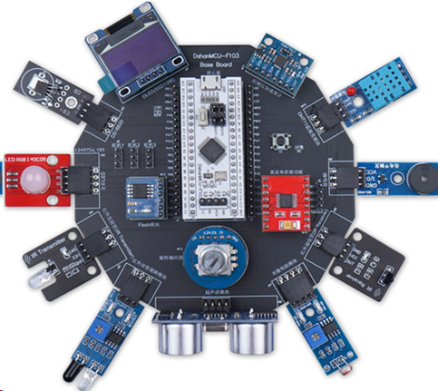
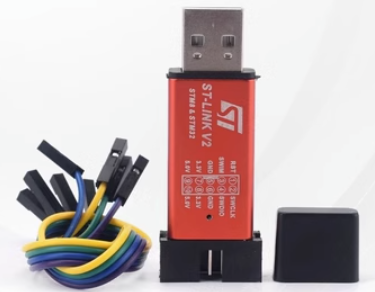
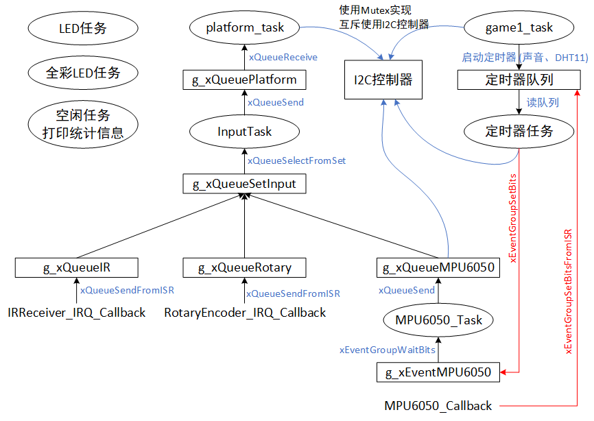

# 讲师介绍与课程风格

悦己之作，方能悦人。

## 1. 讲师介绍

百问网成立于2012年，但是创始人韦东山在2008年已经从事嵌入式软件培训，至今已经15年。
本课程由百问网团队创作，主讲人是韦东山：

* 2003~2004年：珠海友通科技有限公司，硬件板卡开发、驱动开发
* 2004~2005年：深圳神通行科技有限公司，开发基于GSM模块的车载电话，先负责硬件开发，再负责软件开发，进而领导团队
* 2005~2007年：深圳中兴股份有限公司，从事Linux BSP开发
* 2007~2008年：辞职写书《嵌入式Linux应用开发完全手册》，很畅销
* 2008~2011年：作为特聘讲师在各大培训机构讲课，没有入职这些公司，所以可以同时在各机构讲课
* 2011年至今：创立深圳百问网科技有限公司，从事嵌入式Linux培训。所录制的Linux视频在51CTO、CSDN等网站受众200万以上
* 2020年：成为首批HarmonyOS系统课程开发者，获得开发原子开源基金会OpenHarmony项目组开发者贡献奖
* 2021年：开发RTOS培训教程，可以在B站搜“FreeRTOS”、“RT-Thread”，处于前列。其中RT-Thread的课程被放到了官网：https://www.rt-thread.org/video.html#video-neihe
* 各大芯片厂家合作伙伴：全志、ST、瑞萨、平头哥
* 深圳职业技术大学外聘讲师

## 2. 课程风格

* 对于每一个实验，我们会精心设计：要解决什么问题；然后讲解FreeRTOS提供的解决方法

* 讲解FreeRTOS的API及内部原理(不深入讲解内部源码，只是进行原理性介绍)

* 讲解实验过程使用的模块的接口函数（只讲使用，不讲内部实现，模块的源码实现单独开课讲解）

* 讲解原理时，配合着文档、现场画图进行讲解，跟学校老师写黑板一样

* 最后现场从0编写程序并调试

一切都是现场操作，绝对不会照着PPT念，绝对不会照着现成的代码讲解。
只有现场从0操作，学员才能身临其境地学习，跟着视频：碰到问题、解决问题。

## 3. 硬件平台

本课程基于百问网“DshanMCU-103”进行开发，它由3部分组成：STM32F103C8T6的最小系统板、扩展底板、各类模块。如下图所示：

再配一个ST-Link即可学习本课程所有内容：

## 3. 软件平台

STM32CubeMX+Keil

## 4. 程序效果

3个项目：音乐播放、打砖块游戏、汽车游戏

"打砖块游戏"是核心，将会逐步使用FreeRTOS的技术来改进它，它最终的框架如下：

