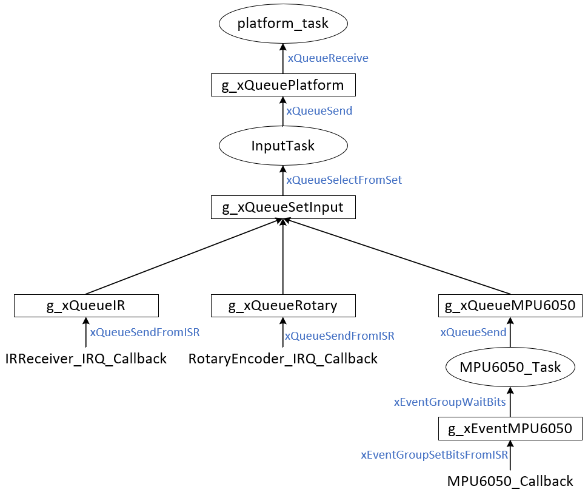

# 两套函数

参考《FreeRTOS入门与工程实践(基于DshanMCU-103)》里

* 《第17章 中断管理(Interrupt Management)》

## 1. 两类API的差别

| 类型                | 在任务中           | 在ISR中                   |
| ------------------- | ------------------ | ------------------------- |
| 队列(queue)         | xQueueSendToBack   | xQueueSendToBackFromISR   |
|                     | xQueueSendToFront  | xQueueSendToFrontFromISR  |
|                     | xQueueReceive      | xQueueReceiveFromISR      |
|                     | xQueueOverwrite    | xQueueOverwriteFromISR    |
|                     | xQueuePeek         | xQueuePeekFromISR         |
| 信号量(semaphore)   | xSemaphoreGive     | xSemaphoreGiveFromISR     |
|                     | xSemaphoreTake     | xSemaphoreTakeFromISR     |
| 事件组(event group) | xEventGroupSetBits | xEventGroupSetBitsFromISR |

## 2. 以写队列为例

|                | xQueueSendToBack                     | xQueueSendToBackFromISR                                      |
| -------------- | ------------------------------------ | ------------------------------------------------------------ |
| 参数不同       | xTicksToWait: 队列满的话阻塞多久     | 没有xTicksToWait                                             |
| 唤醒等待的任务 | 写队列后，会唤醒等待数据的任务       | 写队列后，会唤醒等待数据的任务                               |
| 调度           | 如果被唤醒的任务优先级更高，即刻调度 | 如果被唤醒的任务优先级更高，不会调度 只是记录下来表示：需要调度 |
| 阻塞           | 如果队列满，可以阻塞                 | +如果队列满，不能阻塞                                        |

## 3. 使用示例_改进实时性

本节源码：在"28_timer_game_sound"的基础上，改出：29_fromisr_game

