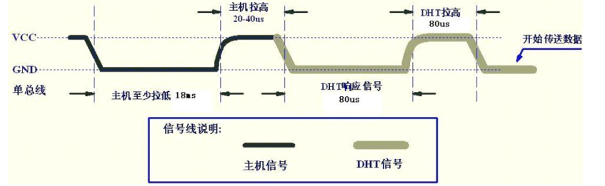
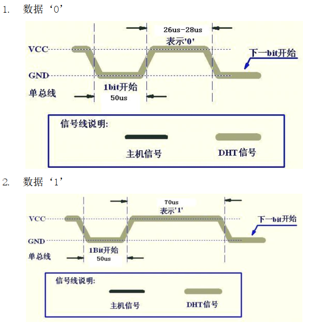

# 资源管理

参考《FreeRTOS入门与工程实践(基于DshanMCU-103)》里

* 《第18章 资源管理(Resource Management)》

## 1. 怎么访问临界资源

谁跟我抢，就先禁止谁！

* 任务A、B都可以使用临界资源，那么访问临界资源前，先禁止任务调度
  * 假设任务A先禁止任务调度，那么任务B就无法执行，任务A可以安心访问临界资源
  * 假设任务B先禁止任务调度，那么任务A就无法执行，任务B可以安心访问临界资源
* 任务A、中断C都可以使用临界资源，那么访问临界资源前，先关闭中断
  * 假设任务A先关闭中断，那么中断C被屏蔽，任务A可以安心访问临界资源
  * 中断C运行过程中，任务A本来就无法执行，所以任务A无法抢占中断C使用的临界资源


## 2. 屏蔽中断

屏蔽中断有两套宏：任务中使用、ISR中使用：

* 任务中使用：`taskENTER_CRITICA()/taskEXIT_CRITICAL()`
* ISR中使用：`taskENTER_CRITICAL_FROM_ISR()/taskEXIT_CRITICAL_FROM_ISR()`


### 2.1 在任务中屏蔽中断

在任务中屏蔽中断的示例代码如下：

```c
int a;
/* 在任务中，当前时刻中断是使能的
 * 执行这句代码后，屏蔽中断
 */
void add_func(int val)
{
	taskENTER_CRITICAL();	

	/* 访问临界资源 */
    a += val;

	/* 重新使能中断 */
	taskEXIT_CRITICAL();
}
```

在`taskENTER_CRITICA()/taskEXIT_CRITICAL()`之间：

* 低优先级的中断被屏蔽了：优先级低于、等于`configMAX_SYSCALL_INTERRUPT_PRIORITY`
* 高优先级的中断可以产生：优先级高于`configMAX_SYSCALL_INTERRUPT_PRIORITY`
  * 但是，这些中断ISR里，不允许使用FreeRTOS的API函数
* 任务调度依赖于中断、依赖于API函数，所以：这两段代码之间，不会有任务调度产生


这套`taskENTER_CRITICA()/taskEXIT_CRITICAL()`宏，是可以递归使用的，它的内部会记录嵌套的深度，只有嵌套深度变为0时，调用`taskEXIT_CRITICAL()`才会重新使能中断。


使用`taskENTER_CRITICA()/taskEXIT_CRITICAL()`来访问临界资源是很粗鲁的方法：

* 中断无法正常运行
* 任务调度无法进行
* 所以，之间的代码要尽可能快速地执行


### 2.2 在ISR中屏蔽中断

要使用含有"FROM_ISR"后缀的宏，示例代码如下：

```c
void a_fuc( void )
{
    UBaseType_t uxSavedInterruptStatus;

    uxSavedInterruptStatus = taskENTER_CRITICAL_FROM_ISR();
    
    /* 访问临界资源 */
    a++;

    taskEXIT_CRITICAL_FROM_ISR( uxSavedInterruptStatus );
}

void vAnInterruptServiceRoutine( void )
{
    /* 用来记录当前中断是否使能 */
    UBaseType_t uxSavedInterruptStatus;
    
    /* 在ISR中，当前时刻中断可能是使能的，也可能是禁止的
     * 所以要记录当前状态, 后面要恢复为原先的状态
     * 执行这句代码后，屏蔽中断
     */
    uxSavedInterruptStatus = taskENTER_CRITICAL_FROM_ISR();
    
    /* 访问临界资源 */
    b++;
    a_fuc();

    /* 恢复中断状态 */
    taskEXIT_CRITICAL_FROM_ISR( uxSavedInterruptStatus );
    /* 现在，当前ISR可以被更高优先级的中断打断了 */
}
```


在`taskENTER_CRITICA_FROM_ISR()/taskEXIT_CRITICAL_FROM_ISR()`之间：

* 低优先级的中断被屏蔽了：优先级低于、等于`configMAX_SYSCALL_INTERRUPT_PRIORITY`
* 高优先级的中断可以产生：优先级高于`configMAX_SYSCALL_INTERRUPT_PRIORITY`
  * 但是，这些中断ISR里，不允许使用FreeRTOS的API函数
* 任务调度依赖于中断、依赖于API函数，所以：这两段代码之间，不会有任务调度产生


## 3. 暂停调度器

如果有别的任务来跟你竞争临界资源，你可以把中断关掉：这当然可以禁止别的任务运行，但是这代价太大了。它会影响到中断的处理。

如果只是禁止别的任务来跟你竞争，不需要关中断，暂停调度器就可以了：在这期间，中断还是可以发生、处理。

使用这2个函数来暂停、恢复调度器：

```c
/* 暂停调度器 */
void vTaskSuspendAll( void );

/* 恢复调度器
 * 返回值: pdTRUE表示在暂定期间有更高优先级的任务就绪了
 *        可以不理会这个返回值
 */
BaseType_t xTaskResumeAll( void );
```


示例代码如下：

```c
int a;
void xxx_func(int val)
{
	vTaskSuspendAll();

	/* 访问临界资源 */
    a = val;

	xTaskResumeAll();
}
```


这套`vTaskSuspendAll()/xTaskResumeAll()`宏，是可以递归使用的，它的内部会记录嵌套的深度，只有嵌套深度变为0时，`xTaskResumeAll()`才会重新使能调度器。


## 4. 资源管理示例_解决DHT11经常出错的问题

本节源码：在"29_fromisr_game"的基础上，改出：30_suspend_all_dht11

DHT11操作时序：




每一bit的时序如下：



