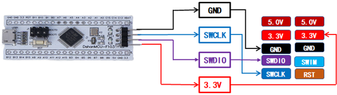
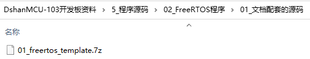

# 开发板使用

## 1. 硬件接线

DshanMCU-103上有4个插针，它们分别是GND、SWCLK、SWDIO、3.3V。ST-Link上有10个插针，它们的功能在外壳上有标注。接线方法如下图所示：

连接好的实物图如下（ST-Link的USB口要插到电脑上）：

## 2. 打开工程

解压如下程序，放入无中文字符的目录里：

使用Keil打开工程。

## 3. 修改代码

## 4. 注意事项

有些模块的引脚是共用的，所以它们要么不能同时接，要么不能同时使用。

打开底板原理图，里面有说明：

列表如下：

| 模块1            | 模块2                | 备注                       |
| ---------------- | -------------------- | -------------------------- |
| M2(DS18B20)      | M10(DHT11温湿度模块) | 不能同时接                 |
| M4(红外发射模块) | M9(蜂鸣器)           | 不能同时接                 |
| M6(超声波模块)   | M12(Flash模块)       | 可以同时接，但是要互斥访问 |

