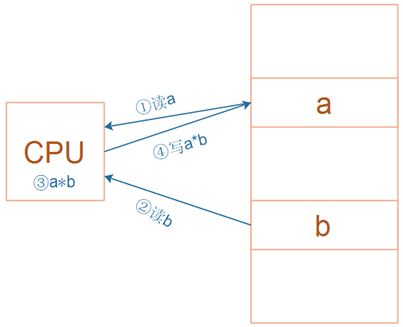
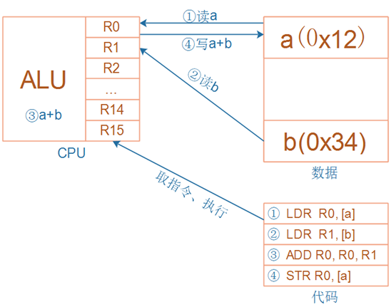
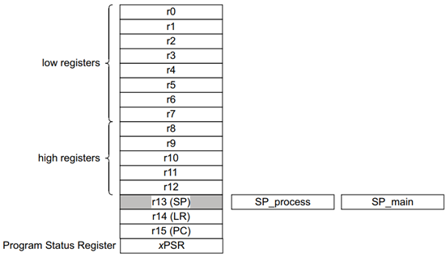
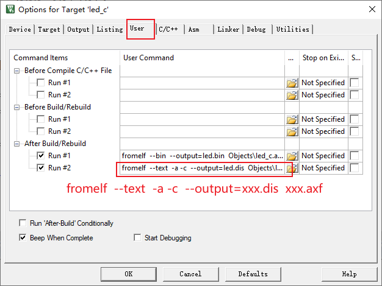

# ARM架构简明教程

## 1. ARM架构

### 1.1 RISC

ARM芯片属于精简指令集计算机(RISC：Reduced Instruction Set Computing)，它所用的指令比较简单，有如下特点：

① 对内存只有读、写指令

② 对于数据的运算是在CPU内部实现

③ 使用RISC指令的CPU复杂度小一点，易于设计



对于上图所示的乘法运算a = a * b，

在RISC中要使用4条汇编指令：

① 读内存a

② 读内存b

③ 计算a*b

④ 把结果写入内存


### 1.2 提出问题

问题：在CPU内部，用什么来保存a、b、a*b ？


### 1.3 CPU内部寄存器



无论是cortex-M3/M4，

还是cortex-A7，

CPU内部都有R0、R1、……、R15寄存器；

它们可以用来“暂存”数据。



对于R13、R14、R15，还另有用途：

R13：别名SP(Stack Pointer)，栈指针

R14：别名LR(Link Register)，用来保存返回地址

R15：别名PC(Program Counter)，程序计数器，表示当前指令地址，写入新值即可跳转


### 1.4 汇编指令

* 读内存：Load

  ```shell
  # 示例
  LDR  R0, [R1, #4]  ; 读地址"R1+4", 得到的4字节数据存入R0
  ```

* 写内存：Stroe

  ```shell
  # 示例
  STR  R0, [R1, #4]  ; 把R0的4字节数据写入地址"R1+4"
  ```

* 加减

  ```shell
  ADD R0, R1, R2  ; R0=R1+R2
  ADD R0, R0, #1  ; R0=R0+1
  SUB R0, R1, R2  ; R0=R1-R2
  SUB R0, R0, #1  ; R0=R0-1
  ```

* 比较

  ```shell
  CMP R0, R1  ; 结果保存在PSR(程序状态寄存器)
  ```

* 跳转

  ```shell
  B  main  ; Branch, 直接跳转
  BL main  ; Branch and Link, 先把返回地址保存在LR寄存器里再跳转
  ```

  


## 2. C函数的反汇编

C函数：

```c
int add(volatile int a, volatile int b)
{
	volatile int sum;
    sum = a + b;
    return sum;
}
```


让Keil生成反汇编：



为例方便复制，制作反汇编的指令如下：

```shell
fromelf  --text  -a -c  --output=xxx.dis  xxx.axf
```


C函数add的反汇编代码如下：

```shell
    i.add
    add
        0x08002f34:    b503        ..      PUSH     {r0,r1,lr}
        0x08002f36:    b081        ..      SUB      sp,sp,#4
        0x08002f38:    e9dd0101    ....    LDRD     r0,r1,[sp,#4]
        0x08002f3c:    4408        .D      ADD      r0,r0,r1
        0x08002f3e:    9000        ..      STR      r0,[sp,#0]
        0x08002f40:    bd0e        ..      POP      {r1-r3,pc}
```


​           


