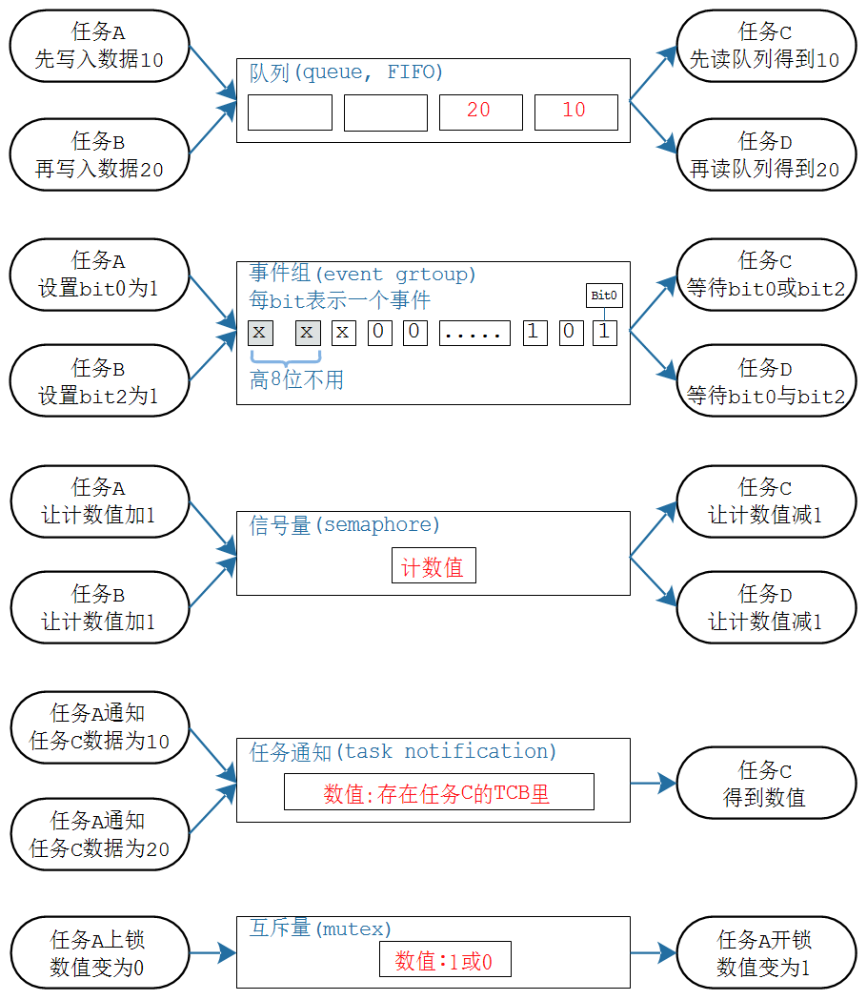

## 同步互斥与通信概述

参考《FreeRTOS入门与工程实践(基于DshanMCU-103)》里《第10章  同步互斥与通信》

### 1. 同步与互斥的概念

### 2. 同步的例子：有缺陷

程序：在06_create_task_use_params的基础上，修改出12_task_sync_exclusion

### 3. 互斥的例子：有缺陷

讲解这个程序"06_create_task_use_params"的互斥缺陷。

### 4. 通信的例子：有缺陷

### 5. FreeRTOS的解决方案

* 正确性

* 效率：等待者要进入阻塞状态

* 多种解决方案

  