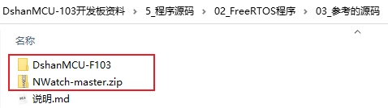

## 游戏机项目说明

### 1. 项目说明

NWatch是一个很漂亮的、基于STM32的开源手表项目。

官方链接为：

* GITHUB：https://github.com/ZakKemble/NWatch  
* 作者博客：https://blog.zakkemble.net/diy-digital-wristwatch/

我们已经下载了这套代码，并且移植出了自己的版本，源码如下：

* NWatch-master.zip：官方源码
* "DshanMCU-F103"目录是给百问网DshanMCU-F103移植好的代码
  * 01_nwatch_game.7z ： 只有打砖块的游戏，裸机程序，未优化
  * 02_nwatch_game_freertos.7z：只有打砖块游戏，FreeRTOS程序，优化了OLED的显示效率，把按键控制、球的控制拆分为2个任务
  * 03_nwatch_dshanmcu-f103_all.7z:  NWatch的完全版本，裸机程序

后续课程，大部分都是在02_nwatch_game_freertos.7z的基础上修改。

### 2. 程序的核心

如何显示各类图标，是这个游戏的核心。

