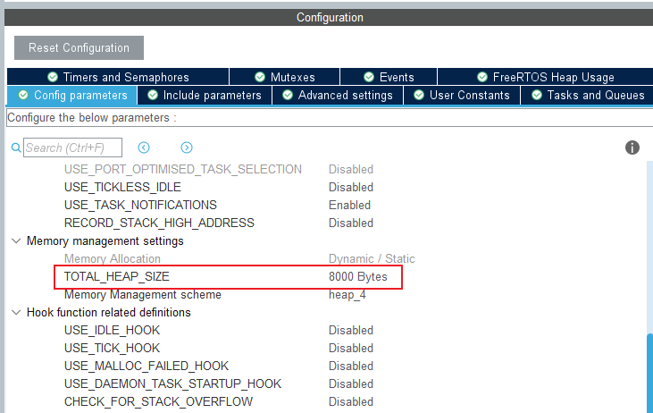

## 队列

参考《FreeRTOS入门与工程实践(基于DshanMCU-103)》里《第11章  队列(queue)》

### 1. 数据传输的方法

#### 1.1 任务之间如何传输数据

多种方法比较：

|            | 数据个数 | 互斥措施 | 阻塞-唤醒 | 使用场景 |
| ---------- | -------- | -------- | --------- | -------- |
| 全局变量   | 1        | 无       | 无        | 一读一写 |
| 环形缓冲区 | 多个     | 无       | 无        | 一读一写 |
| 队列       | 多个     | 有       | 有        | 多读多写 |


#### 1.2 队列的本质

队列中，数据的读写本质就是环形缓冲区，在这个基础上增加了互斥措施、阻塞-唤醒机制。

如果这个队列不传输数据，只调整"数据个数"，它就是信号量(semaphore)。

如果信号量中，限定"数据个数"最大值为1，它就是互斥量(mutex)。


画图演示队列的"阻塞-唤醒"机制。


#### 1.3 队列的函数


### 2. 队列实验_多设备玩游戏

本节源码：在"03_参考的源码/DshanMCU-F103/02_nwatch_game_freertos.7z"的基础上

* "13_queue_game": 使用队列读取红外遥控器按键
* "14_queue_game_multi_input": 在"13_queue_game"的基础上，增加旋转编码控制功能

实验目的：使用红外遥控器、旋转编码器玩游戏。

实现方案：

* 游戏任务：读取队列A获得控制信息，用来控制游戏
* 红外遥控器驱动：在中断函数里解析出按键后，写队列A
* 旋转编码器：
  * 它的中断函数里解析出旋转编码器的状态，写队列B；
  * 它的任务函数里，读取队列B，构造好数据后写队列A


### 3. 队列集实验

#### 3.1 改进程序框架

本节源码：在"14_queue_game_multi_input"的基础上，改出"15_queueset_game"，具备更好的程序框架。

修改“Core\Inc\FreeRTOSConfig.h“，增加：

```c
/* USER CODE BEGIN Includes */
#define configUSE_QUEUE_SETS 1
/* Section where include file can be added */
/* USER CODE END Includes */
```

在STM32CubeMX里把堆调大，比如8000：




#### 3.2 增加姿态控制

本节源码：在"15_queueset_game"的基础上，改出"16_queueset_game_mpu6050"，支持6轴传感器，使用姿态控制玩游戏。

本课程专注于FreeRTOS，对于MPU6050的操作细节不做过多介绍（会在HAL课程里讲解）。

也可以参考：https://zhuanlan.zhihu.com/p/30621372


### 4. 队列实验_分发数据给多个任务(赛车游戏)

本节源码：在"16_queueset_game_mpu6050"的基础上，改出"17_queue_car_dispatch"

红外遥控器的中断函数解析出按键值后，写入3个队列：3个赛车任务读取其中一个队列得到按键数据。

